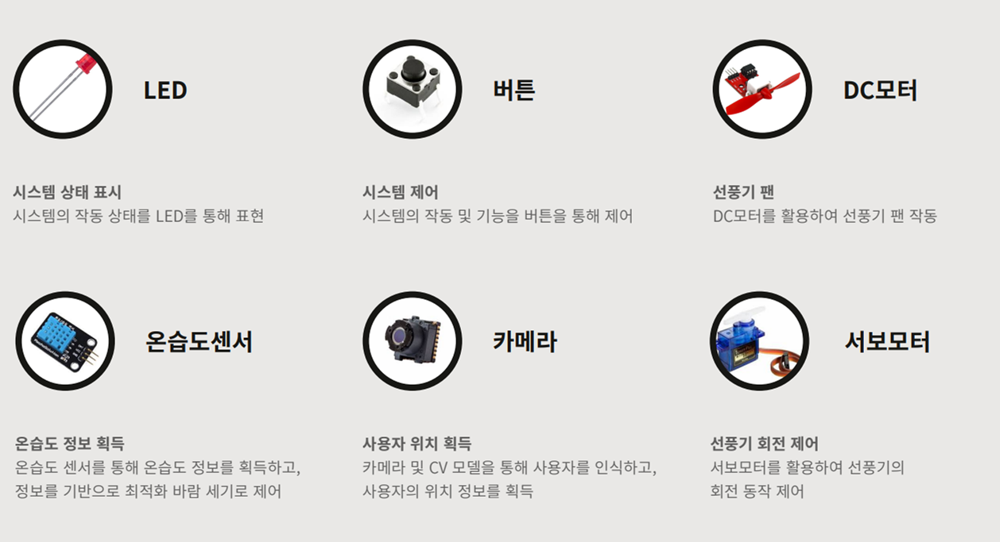
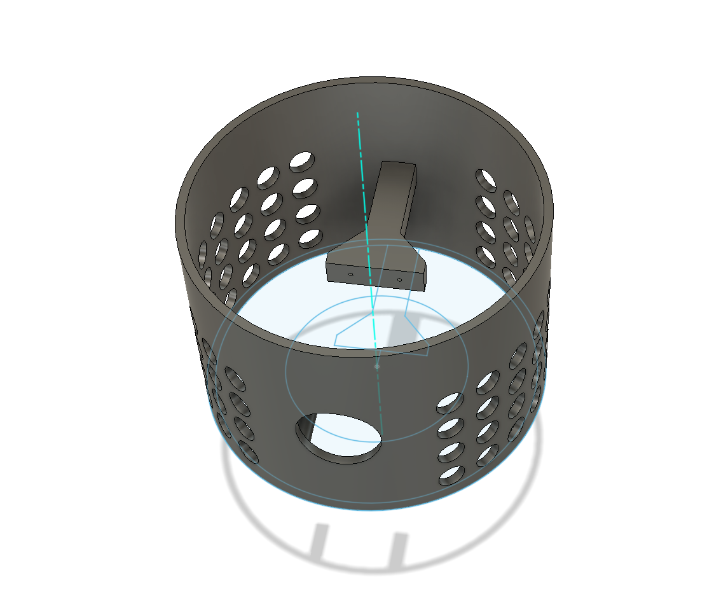
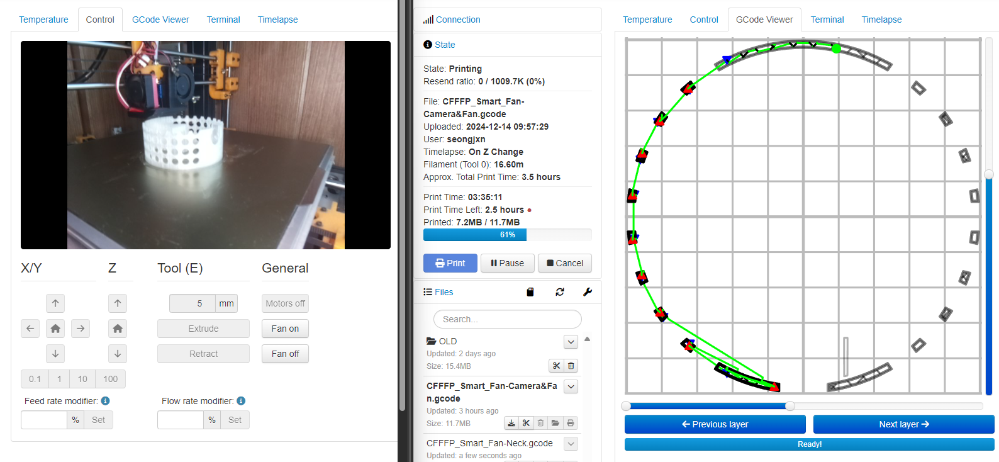
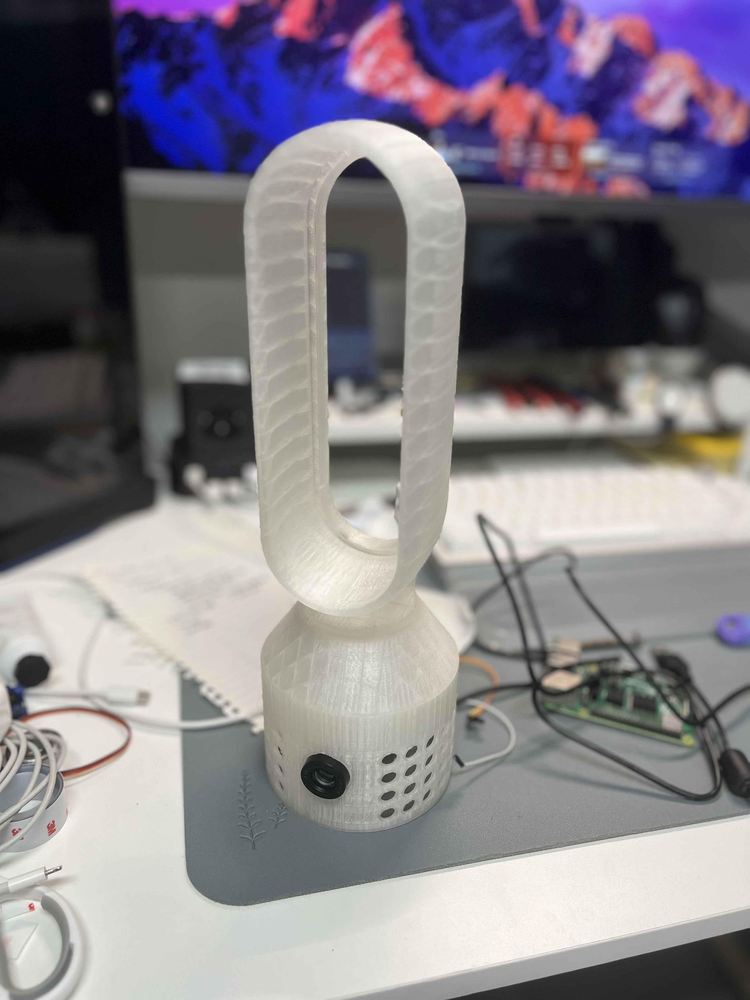

<p align="center">
  
</p>

> 다가올 여름, <a href="https://namu.wiki/w/%EB%A1%9C%EC%BC%93%EB%8B%A8%20%EC%82%BC%EC%9D%B8%EB%B0%A9/%EB%93%B1%EC%9E%A5%20%EB%8C%80%EC%82%AC">우리에겐 아름다운 미래 · 밝은 내일이 기다리고 있다-</a>


<br>


## 🧭 Navigation
1. <b>[💡 Idea introduction](#-idea-introduction)</b>
2. <b>[⚙️ System architecture](#-system-architecture)</b>
3. <b>[🔒 Implementation of constraints](#-implementation-of-constraints)</b>
4. <b>[🛠 Hardware Manufacturing Process](#-hardware-manufacturing-process)</b>
5. <b>[📽️ Demo](#-demo)</b>
6. <b>[📄 Documents](#-documents)</b>
7. <b>[👨‍💻 Contributors](#-contributors)</b>


<br>


## 💡 Idea introduction
<p align="center">
  
</p>

> "다가올 여름, <a href="https://namu.wiki/w/%EB%A1%9C%EC%BC%93%EB%8B%A8%20%EC%82%BC%EC%9D%B8%EB%B0%A9/%EB%93%B1%EC%9E%A5%20%EB%8C%80%EC%82%AC">우리에겐 아름다운 미래 · 밝은 내일이 기다리고 있다-</a>"


<br>


## ⚙ System architecture
<p align="center">
  
</p>

<details>
  <summary><b>Click to Show More Information</b></summary>

  <p align="center">
    
  </p>
</details>


<br>


## 🔒 Implementation of constraints
`main.c`
```c
...
    // 공유 메모리 생성
    int shmid = shmget(SHM_KEY, sizeof(SensorData), IPC_CREAT | 0666);
    if (shmid < 0) {
        perror("shmget failed");
        exit(1);
    }

    // 공유 메모리 연결
    SensorData* data = (SensorData*)shmat(shmid, NULL, 0);
    if (data == (SensorData*)-1) {
        perror("shmat failed");
        exit(1);
    }

    // 뮤텍스 초기화
    if (pthread_mutex_init(&data->mutex, NULL) != 0) {
        perror("pthread_mutex_init failed");
        exit(1);
    }
...
    // manualControl 실행
    printf("[main] Running manualControl...\n");
    if (fork() == 0) {
        execlp("./manualControl", "manualControl", NULL);
        perror("[main] exec manualControl failed");
        exit(1);
    }
    // getHumiTemp 실행
    printf("[main] Running getHumiTemp...\n");
    if (fork() == 0) {
        execlp("./getHumiTemp", "getHumiTemp", NULL);
        perror("[main] exec getHumiTemp failed");
        exit(1);
    }

    // fanControl 실행
    printf("[main] Running fanControl...\n");
    if (fork() == 0) { // 자식 프로세스 생성
        execlp("./fanControl", "fanControl", NULL);
        perror("[main] exec fanControl failed");
        exit(1);
    }

    // rotateControl 실행
    printf("[main] Running rotateControl...\n");
    if (fork() == 0) {
        execlp("./rotateControl", "rotateControl", NULL);
        perror("[main] exec rotateControl failed");
        exit(1);
    }
...
```
> - 공유 메모리를 활용해 프로세스 간 데이터 교환이 가능하도록 구현.
> - Mutex를 활용하여 데이터 교환 시 deadlock을 방지할 수 있도록 구현.
> - 각 기능별로 프로세스를 분리하여 멀티프로세스로 구현.

<br>

`rotateControl.c`
```c
...
// 메시지 수신 (문자열 형식)
if (mq_receive(mq, angle_str, sizeof(angle_str), NULL) == -1) {
    perror("[rotateControl] mq_receive 실패");
    sleep(1);
    continue;
}

...
```

`detectHuman.py`
```python
...

try:
    mq.send(f"{angle:3.2f}")
    print(f"[detectHuman] 전송된 각도: {angle:.2f}도")
except posix_ipc.BusyError:
    print("[detectHuman] 메시지 큐 가득 참: 전송 실패")

...
```

> - 사용자가 위치한 방향으로 선풍기가 회전하도록 만들기 위해 OpenCV 및 Google의 MediaPipe 사용.
> - Python 코드와의 연동을 위해 Message Queue 사용.


<br>


## 🛠 Hardware Manufacturing Process
1. <a href="https://namu.wiki/w/Fusion%20360">Autodesk Fusion 360</a>으로 선풍기 본체 모델링
> 
2. 3D 프린터를 활용하여 선풍기 본체 출력
> 
3. 본체 완성
> 


<br>


## 📽 Demo
<p align="center">
  
</p>

> 편리하다는 것, 그것은 신경 쓰지 않아도 된다는 것.


<br>


## 📄 Documents

| No |    Date    |       Topic       |    Link    |
|----|------------|-------------------|------------|
| 01 | 2024-11-19 |     제안 발표     | [PDF](Docs/presentations/임베디드시스템_TEAM_ApplePi_제안발표.pdf) |
| 02 | 2024-12-16 |     최종 발표     | [PDF](Docs/presentations/임베디드시스템%204조%20최종%20발표.pdf) |


<br>


## 👨‍💻 Contributors
<table>
  <td align="center">
    <a href="https://github.com/seongjxn">
      <br>
      SeongJin Jang
    </a>
    <br><sub>(20220997)</sub>
  </td>
  <td align="center">
    <a href="https://github.com/paksh0725">
      <br>
      paksh0725
    </a>
    <br><sub>(20220440)</sub>
  </td>
  <td align="center">
    <a href="https://github.com/Yoon-men">
      <br>
      Yoonmen
    </a>
    <br><sub>(20220736)</sub>
  </td>
  <td align="center">
    <a href="https://github.com/wonotter">
      <br>
      Wonho Kim
    </a>
    <br><sub>(20190250)</sub>
  </td>
</table>
