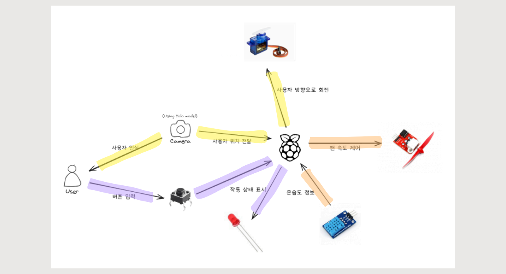

# Smart-Fan
> 다가올 여름, <a href="https://namu.wiki/w/%EB%A1%9C%EC%BC%93%EB%8B%A8%20%EC%82%BC%EC%9D%B8%EB%B0%A9/%EB%93%B1%EC%9E%A5%20%EB%8C%80%EC%82%AC">우리에겐 아름다운 미래 · 밝은 내일이 기다리고 있다-</a>

## 💡 Idea introduction

  
  
  

 

## 📽️ Demo

  

> 편리하다는 것, 그것은 신경 쓰지 않아도 된다는 것.

 

## 📄 Documents

| No |    Date    |       Topic       |    Link    |
|----|------------|-------------------|------------|
| 01 | 2024-11-19 |     제안 발표     | [PDF](Docs/presentations/임베디드시스템_TEAM_ApplePi_제안발표.pdf) |
| 02 | 2024-12-16 |     최종 발표     | [PDF](Docs/presentations/임베디드시스템%204조%20최종%20발표.pdf) |

 

## 👨‍💻 Contributors
<table>
  <td align="center">
    <a href="https://github.com/seongjxn">
       
      SeongJin Jang
    </a>
     (20220997)
  </td>
  <td align="center">
    <a href="https://github.com/paksh0725">
       
      paksh0725
    </a>
     (20220440)
  </td>
  <td align="center">
    <a href="https://github.com/Yoon-men">
       
      Yoonmen
    </a>
     (20220736)
  </td>
  <td align="center">
    <a href="https://github.com/wonotter">
       
      Wonho Kim
    </a>
     (20190250)
  </td>
</table>
